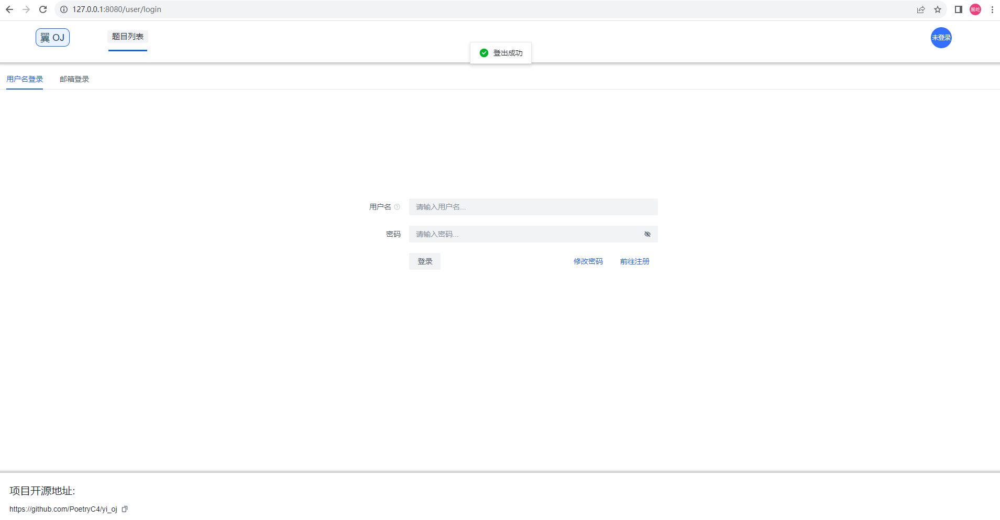
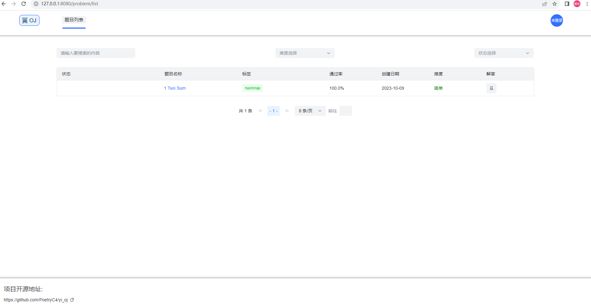
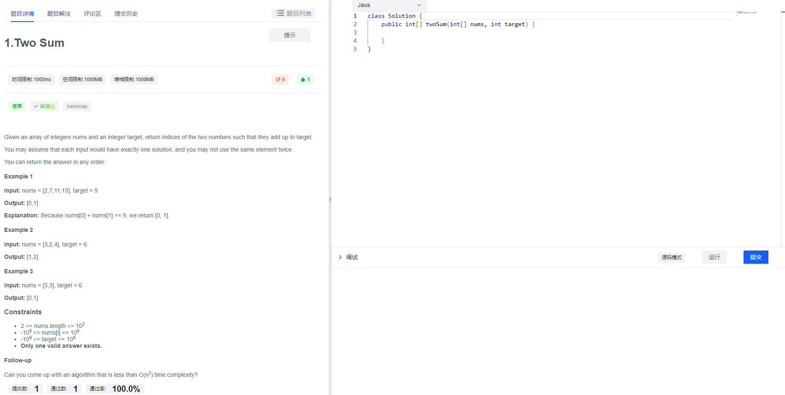
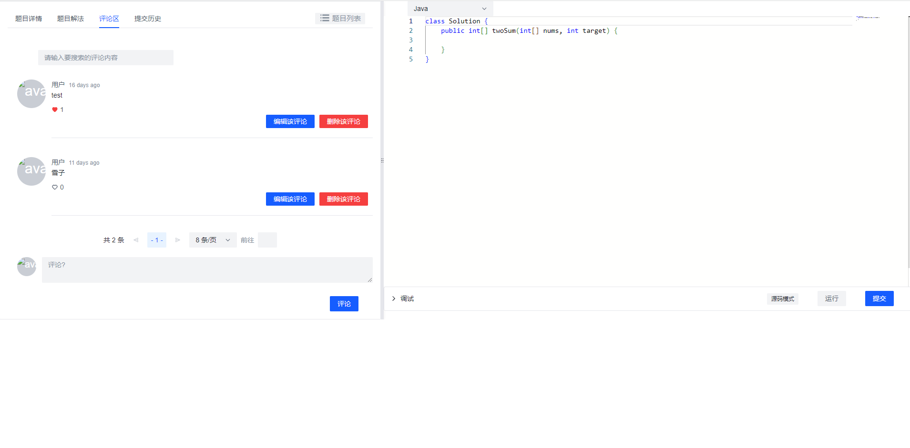
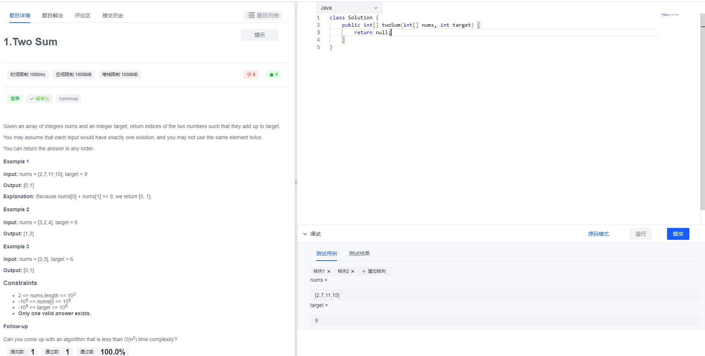
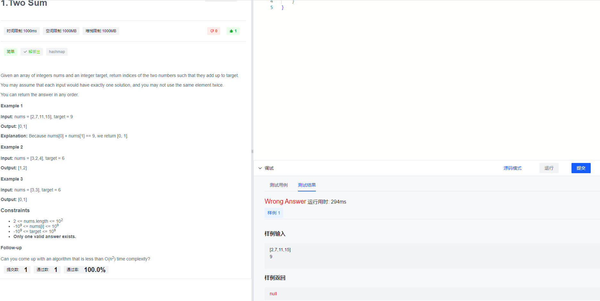
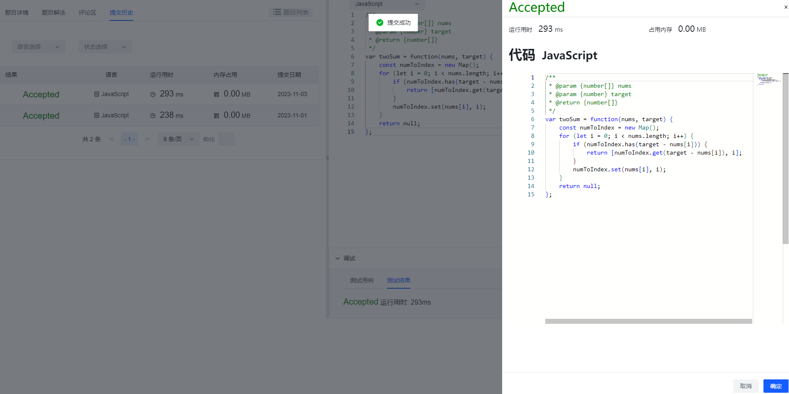
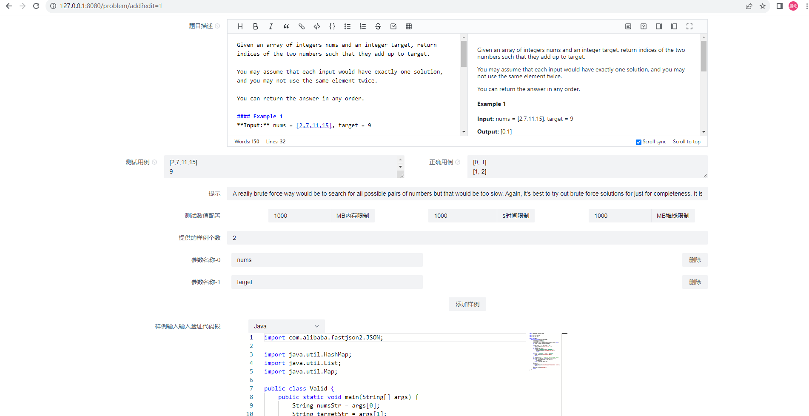
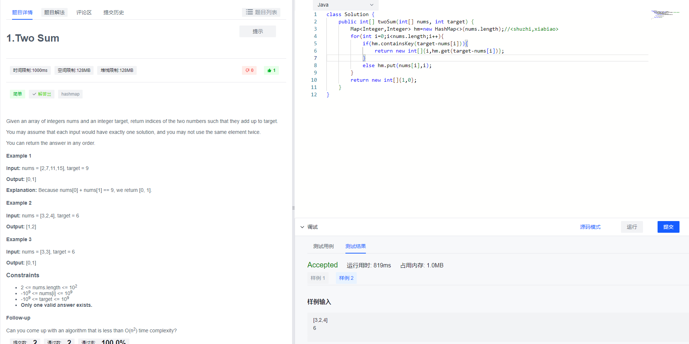

# 翼_OJ

## 项目简介

这是个仿leetcode的自制OJ系统，参考教程[OJ 判题系统](https://www.codefather.cn/oj-%E5%88%A4%E9%A2%98%E7%B3%BB%E7%BB%9F/)，目前已支持Java和JavaScript做题。

该系统后端使用SpringBoot+SprongCloudAlibaba+Nacos配置中心+OpenFeign+Redis实现微服务构建，使用MySQL储存数据，使用JWT进行签名验证，esilience4j实现限流，熔断和降级，其中设计模式使用了工厂模式，模板模式，代理模式，策略模式。

该系统判题模块使用Java操作Docker实现隔离环境运行代码，保证一定的安全性，包括权限限制，内存限制，时间限制等。

该系统前端使用Vue3+TypeScript+ArcoDesign+Axios构建。

相关Redis，MySQL，ElasticSearch的配置如果需要可以自行修改。

TODO:
1. 添加COS

## 效果图

